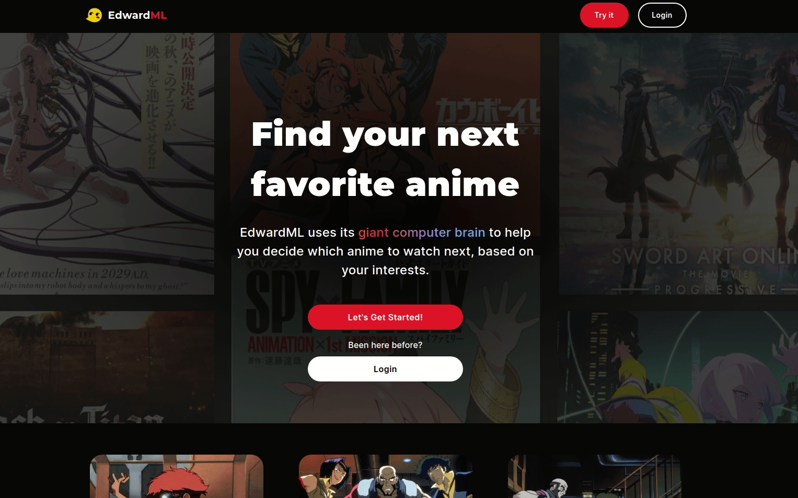

# EdwardML

This project provides anime recommendations based on a user's taste profile.

**[Live site can be found here](https://anime-finder-b3751.web.app/)**

## GALLERY:

## BACKGROUND:

This single page web application allows anime fans to discover their next favorite anime series based on machine learning generated recommendations.

## TECHNOLOGIES USED:

- React
- Firebase Authentication
- Firestore Database
- Material UI
- Tanstack Query (caching)
- React-Hook-Form (form validation)
- Yup (custom schema validation)

## CREDITS:

This is a collaborative project developed by [Ken Metz](https://github.com/KennethMetz) and [Steve Metz](https://github.com/metzsg).
